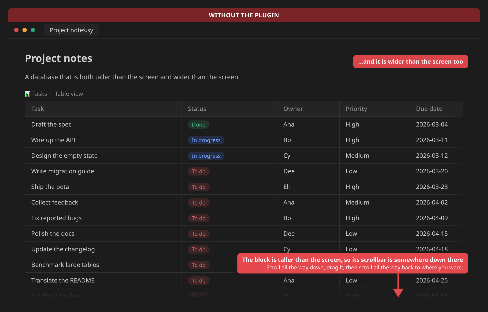
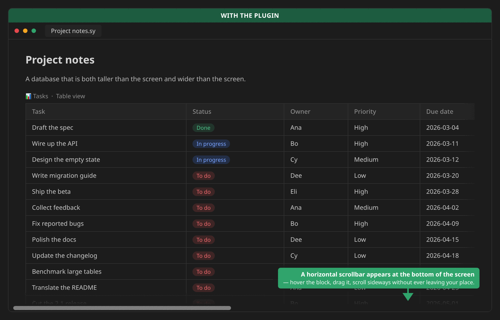
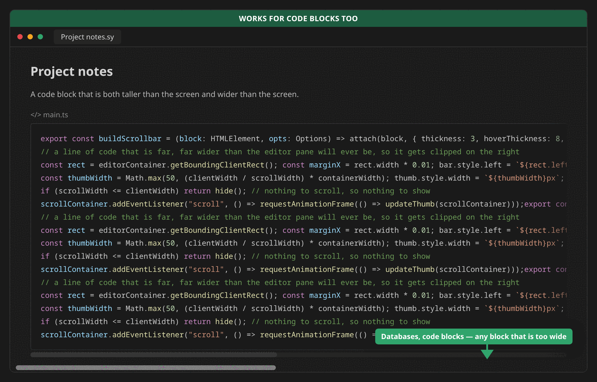

# Block horizontal scrollbar plugin

For blocks with a length exceeding the screen length and a width exceeding the screen width (such as databases, code blocks, etc.), Siyuan only provides a horizontal scrollbar at the bottom of the block. If you only want to operate with the mouse, you can only scroll vertically to the bottom of the block, drag the scrollbar, and then scroll vertically back to the original position.

The function of this plugin is that if the plugin detects that your block is too long and too wide, it will add a horizontal scrollbar at the bottom of the screen. You can use that scrollbar to perform horizontal scrolling without using the scrollbar at the bottom of the block.

## Without the plugin

## With the plugin

## Works for code blocks too

